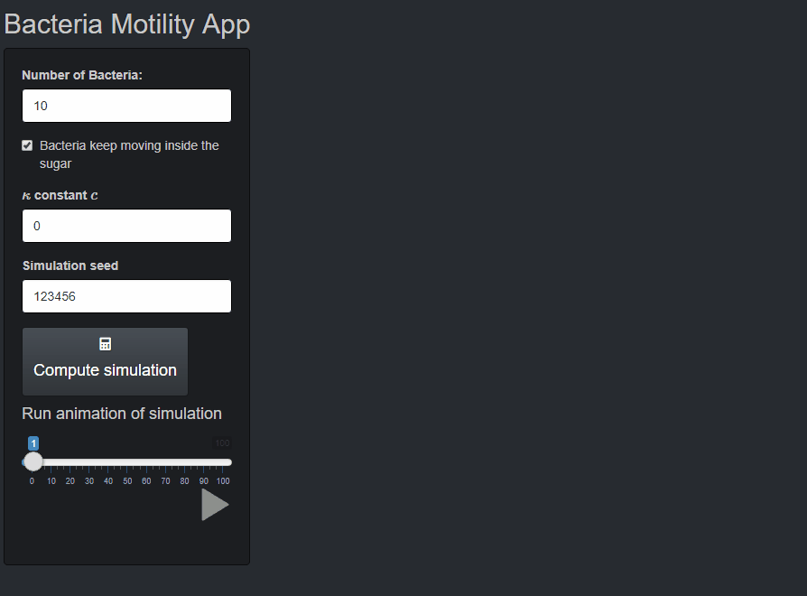

# Homework 4


## Objectives :full_moon_with_face: 
The objectives of this homework assignment are the followings:

- Build your own R packages
- Create and develop an interactive Shiny web-application

## Deadline :alarm_clock:

Submit the homework at last by Monday 28th of November 2022 at 23:59pm 
by pushing to the dedicated repository.

## Requirements :warning:

This homework **must** be accomplished using the appropriate GitHub template and respect the following requirements:

- All members of the group must commit at least once.
- All commit messages must be reasonably clear and meaningful.
- Your GitHub repository must include at least the following:
  + One issue containing some form of __TO DO__ list.
  + One pull request followed by a merging.

You can create one or several RMarkdown files to answer the following problems:

## Content :rocket: 

### Easy variance III

#### Problem statement
The bootstrap is a straightforward method for estimating quantities for a statistic such as an estimator of its variance. 

#### Exercise 1

1.  Using your most efficient implementation of the bootstrap from the previous homework, modify the output to return an object of class `bootstrap`.

2. Write a `print` method for the `bootstrap` class such that the output looks like:
```{r}
> boot <- bootstrap(rnorm(100), statistic = var)
> boot
Non-parametric bootstrap estimate of the variance of 'var'
-----------------
Variance estimate is 0.0236
Based on B=1000 bootstrap replicates
and a sample of size: 100

> boot2 <- bootstrap(matrix(rnorm(200),nc=2), statistic = var)
> boot2
Non-parametric bootstrap for 'var'
-----------------
Variance estimate is 0.0094
Based on B=1000 bootstrap replicates
and a (coerced) sample of size: 200
```
3. Write a `summary` method for the `bootstrap` class that returns an object of class `summary.bootstrap`. This summary method should have a `level` argument and compute a two-sided confidence interval as follows: $IC(\alpha) = (\hat{\theta}+\sqrt{\hat{\sigma}^2}z_{\alpha/2}, \hat{\theta}+\sqrt{\hat{\sigma}^2}z_{1-\alpha/2}),$ where $\hat{\theta}$ is the statistic on the sample, $\hat{\sigma}^2$ is the bootstrap estimate of the variance of the statistic and $z_\alpha$ is the $\alpha\in(0,1)$ quantile of the standard normal distribution, $\alpha$ is the level. Write a `print` method for a `summary.bootstrap` object such that the output looks like:
```{r}
> summary(boot)
Non-parametric bootstrap for 'var'
Number of bootstrap replicates: 1000

Statistic on the sample 'x': var(x)=1.08

Confidence interval at the 95%-level: 
0.78 1.38 

Bootstrap estimates: 
   Min. 1st Qu.  Median    Mean 3rd Qu.    Max. 
   0.51    0.96    1.06    1.06    1.17    1.49 

> summary(boot2)
Non-parametric bootstrap for 'var'
Number of bootstrap replicates: 1000

Statistic on the sample 'x': var(x)=0.95
Notice: 'x' was coerced to a vector

Confidence interval at the 95%-level: 
0.76 1.14 

Bootstrap estimates: 
   Min. 1st Qu.  Median    Mean 3rd Qu.    Max. 
   0.65    0.88    0.94    0.95    1.01    1.30
```

4. Verify and modify your implementation of the `summary` and `print` methods of point 3. such that you obtain the following:
```{r}
> summary(boot, level = .8)
...
Confidence interval at the 80%-level: 
0.88 1.28 
...

> summary(boot, level = 1.2)
Error in summary.bootstrap(boot, level = 1.2) : 'level' must be in (0,1)

> print(summary(boot), digits=5)
...
Statistic on the sample 'x': var(x)=1.07986

Confidence interval at the 95%-level: 
0.77876 1.38096 
...

> summary(bootstrap(matrix(rnorm(200),nc=2), statistic = median, B=1e4))
Non-parametric bootstrap for 'median'
Number of bootstrap replicates: 10000

Statistic on the sample 'x': median(x)=-0.13
Notice: 'x' was coerced to a vector

Confidence interval at the 95%-level: 
-0.27 0.01
...
```

5. Write a `plot` method for the class `bootstrap`. You should obtain something looking like this:
```{r}
plot(boot)
```


Verify that your implementation does the following
```{r}
plot(boot, main="Test", cex=2, horizontal=T)
```


and modify accordingly if it not the case.

#### Exercise 2: build an R package
For this problem, we simply wrap functions of the previous problem into a package:

- Create a package `pkghw4gN` (where `N` is your group name) in RStudio: File -> New Project... -> New Directory -> R Package.

- Create a new GitHub repo `pkghw4gN` (where `N` is your group number) in the `ptds2022` organization and synchronize it with your "initial" package.

- Copy the functions from the previous problem into the `R/` folder. Commit.

- Document all the functions using `roxygen2` comments. Use `devtools::document()` to generate help files afterwards. Do not forget to specify `@export` in `roxygen2` comments to export functions into `NAMESPACE` (make it visible outside the package). You should at least have the following tags: `@title`, `@authors`, `@params`, `@return`, `@examples` (or `@example`). Commit.

- Fill in the `DESCRIPTION` file as much as possible. Commit.

- Clean up the auto-generated file `hello.R` and `hello.Rd`, from `R/` and `man/`, respectively. Commit.

- Remove `NAMESPACE` file, since it was not auto-generated by `roxygen2` (and, therefore, prevents `roxygen2` to overwrite `NAMESPACE`). Then, evoke the command `devtools::document()` to generate it. Commit.

At the end of each step, please, do not forget to commit with a meaningful message.

Note that if you use other packages, you have to specify it in `DESCRIPTION` file in the `Imports` section. To use the function from a package you have to specify its namespace. That is, use `pkg::function()` for a function.

At this step, you should verify if everything works well. You need to `Install and Restart` (in `Build` tab) and try to run `bootstrap()`, as well as look at the help file by `?bootstrap`.

- Add automatic tests with `testthat`. You should at least have one test per function. For example, make sure that you obtain a given error when a "wrong" input is provided. You should at least use the test performed in the previous exercise.

- Correct every errors, warnings and notes obtained from `devtools::check()` (or equivalently clicking on `Check`).

- Add Github action to make automatic checks for at least Windows, MAC and Ubuntu OS.

- Create a website with `pkgdown`. Build it and create Github action.


### Bacteria Motility

#### Exercise 3: Simulate the model

In this problem you will simulate bacterium searching for food in a 2D plane.

Let us consider the problem where we observe $N=25$ bacterium that are randomly moving on a 2D space and looking for food. One way for bacterium to move on such a space is the so-called "run and tumble" motion. Under such motion, the bacterium swims in a given direction (running) and randomly changes its direction (tumbling). You can observe such a biological process in this [video](https://www.youtube.com/watch?v=CATidoe0fDo&feature=youtu.be). This method can be modelled as a 2 dimensional random walk where the length of step $S_t$ in a given random direction at time $t$ is a random variable generated by $S_t \sim U(a,b)$. For this exercise, we use $a = 0$ and $b = 2$.

We define the position of a bacteria at time $t$ as $\left\lbrack \matrix{x_{t} \cr y_{t}} \right\rbrack.$ 

The position at the next step can be obtained by $\left\lbrack\matrix{x_{t+1} \cr y_{t+1}}\right\rbrack = \left\lbrack\matrix{x_{t} \cr y_{t}}\right\rbrack + S_{t}\left\lbrack\matrix{\cos(\delta_{t}) \cr \sin(\delta_{t})}\right\rbrack,$ where $\delta_t$ is the angle in radian defined as the random variable $\delta_t \sim U(0,2\pi)$. 

For this exercise, we consider the initial position of the $i^{th}$ bacteria as $\left\lbrack \matrix{x_{0} \cr y_{0}} \right\rbrack,$ where $x_0, y_0$ $\sim U(-8,8)$ independently.

Food for bacteria is usually a simple sugar, such as glucose. To illustrate the food, we consider a circle of radius $3$ centered at the origin (the point (0,0)). Furthermore, there exist two options to model the movement of the bacteria once it reaches the circle of sugar. Indeed, you are free to decide that either the bacteria stays at the exact same position once it has reached the sugar, or it keeps moving randomly inside the circle.

In this problem, you are asked to write a program that allows to visualize the trajectory of the $25$ bacterium looking for food in a cartesian plane, for the iteration $t =1, \ldots, 120$. The program should produce a similar output as the following:


and the final graph should look similar to this:


#### Exercise 4: Shiny Bacteria App

In this exercise you will revisit the problem considered in Exercise 3 regarding the simulation of bacterium searching for food on a 2D plane.

This time we consider a slightly more complicated model of the "run and tumble" motion of these bacteria and, on top of this more complex model, you will program a web app that allows to perform simulations of bacteria trajectories. 

Lets consider $\delta_t$, the angle in radian, as a random variable that follows a Von Mises distribution, i.e. $\delta_t \sim VM(\mu, \kappa),$ with 
$$\kappa = c \cdot \left(\left\| \left\lbrack \matrix{x_t \cr y_t} \right\rbrack - \left\lbrack \matrix{x_s \cr y_s} \right\rbrack \right\|_2\right)^{-1},$$
where $\left\lbrack \matrix{x_s \cr y_s} \right\rbrack$ is the center of the circle of sugar and $c$ is a tuning parameter. Moreover, $\mu$ is the angle in radian in which the bacterium has to swim to reach the center of the circle of sugar at time $t$.

The Von Mises distribution has some interesting properties. For example, as the $\kappa$ parameter value increases, the distribution approaches a normal distribution centered at $\mu$. On the other hand, as the $\kappa$ parameter value decreases, the distribution approaches a uniform distribution. You can find further information regarding the Von Mises distribution [here](https://en.wikipedia.org/wiki/Von_Mises_distribution).

<div style="text-align:center"></div style="text-align:center">

The underlying intuition that motivates to consider this distribution for the angle $\delta_t$ is that we can expect bacteria to be more likely to move towards the center of the circle when they are close to it than when they are away from it (because they smell and are attracted towards sugar).

Similarly as before, you will consider the initial position of the $i^{th}$ bacteria as $\left\lbrack\matrix{x_{0} \cr y_{0}} \right\rbrack,$ where $x_0, y_0$ $\sim U(-8,8)$ independently.

You are asked to program a web application using Shiny that should possess the following functionalities:

- The user can compute the trajectories of $N$ bacteria based on the model defined above where $N \in \{1,\ldots,50\}$, where the tuning constant $c \in \{0, \ldots, 100\}$ (in the formula of $\kappa$) and where the user can select whether or not bacteria keep moving randomly inside the circle once they reach it.

- The user should be able to select the `random seed` of the program so that you can compute reproducible results.

- The user can plot an animation of the trajectories of the bacterium in the plane.

- At each step $t$, the number of bacteria inside the circle of sugar is indicated.

Here is an animation that illustrates a possible outcome of the web application you are asked to program:


